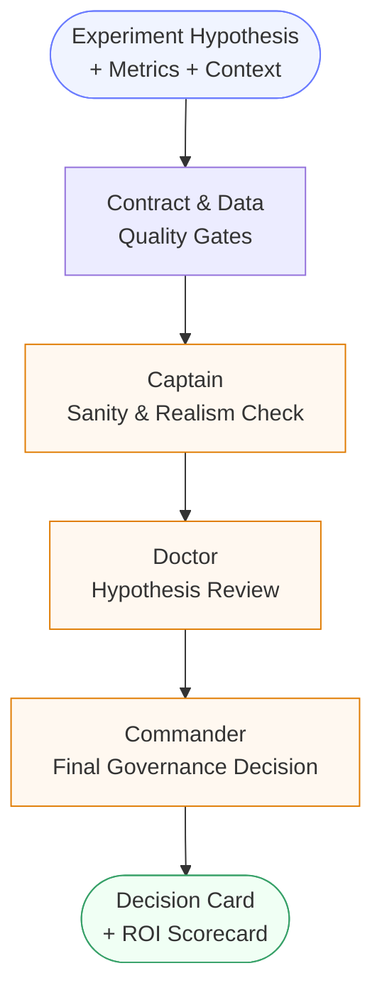

# DecisionGuard

> Multi-agent governance framework protecting product decisions from toxic metrics and Goodhart's Law via deterministic LLM guardrails.

[](https://github.com/SA-Guliy/DecisionGuard/actions/workflows/ci-governance.yml)
[](https://www.python.org/downloads/release/python-311/)
[]()
[]()
[]()

---

<!-- Demo GIF: replace the block below with your recorded scenario -->
> **Demo scenario:** Flash discount experiment scores +15% conversion locally →
> system surfaces historical precedent (GP margin −12.5%, fill-rate −24%) →
> verdict: `HOLD_NEED_DATA` with cited evidence. Cost: $0.002. Latency: 888ms.
>
> *[GIF coming — see [demo scenario](docs/demo_scenario.md) to record]*

---

## Table of Contents

- [What It Is](#what-it-is)
- [Why It Exists](#why-it-exists)
- [How It Works](#how-it-works)
- [Evidence-Grounded Decisions (RAG)](#evidence-grounded-decisions)
- [Paired Experiment Mode](#paired-experiment-mode)
- [PoC Results](#poc-results-mass_test_003--20-cases-darkstore-domain)
- [Engineering Depth](#engineering-depth)
- [Key Design Decisions](#key-design-decisions)
- [Provisional Decision Flow](#provisional-decision-flow)
- [Synthetic Simulation Engine](#synthetic-simulation-engine)
- [System Boundaries & Assumptions](#system-boundaries--assumptions)
- [Compared To](#compared-to)
- [Quick Start](#quick-start)
- [Security & Tech Debt](#security--tech-debt-path-to-production)
- [Repository Layout](#repository-layout)
- [Investor Demo Assets](#investor-demo-assets)
- [GitHub Release Packaging](#github-release-packaging-staging_only)

---

## What It Is

**DecisionGuard** is an AI-Driven A/B Test Governance Layer — not an experimentation platform, but a policy-enforcement layer on top of one.

It is built for businesses where a statistically "successful" A/B test can still damage real P&L through delayed side effects: margin erosion, fulfillment stress, customer churn, or support spikes.

The runtime runs a deterministic multi-agent chain — **Captain → Doctor → Commander** — against every experiment before rollout approval. Each agent has a specific role, bounded by machine-readable domain contracts. No hardcoded business logic. No silent pass-throughs.

---

## Why It Exists

Standard A/B testing tools answer: _"Did this variant win?"_
DecisionGuard answers: _"Is it safe to ship, given all guardrails, unit economics, and risk context?"_

A variant with +8% AOV that quietly erodes fill rate below threshold is a NO-GO. The system catches that, documents why, and keeps the business moving via provisional fallback — without blocking the pipeline.

---

## How It Works



Each agent call passes through two cross-cutting layers:

| Layer | Trigger | What it does |
|-------|---------|-------------|
| **Privacy** | Every cloud LLM call | Replaces sensitive values with vectorized placeholders before sending; reverses mapping on response. AES-256-CBC encrypted obfuscation map, never persisted in plaintext |
| **Resilience** | Every agent call | Groq → Ollama → Deterministic local. Fallback result tagged `[PROVISIONAL]`, flagged for cloud reconciliation on recovery |
| **Integrity** | Every artifact read/write | SHA256 sidecar on every file. Tamper or missing sidecar = immediate `FAIL` |
| **Audit** | Every cloud call | Append-only `audit_log.jsonl` with `run_id`, `policy_ref`, `model`, `timestamp` |

Technical deep-dive: [`ARCHITECTURE.md`](ARCHITECTURE.md)

---

## Evidence-Grounded Decisions

Most governance tools block based on current metrics or static rules. DecisionGuard grounds every decision in **historical experiment outcomes** via a semantic retrieval layer.

Before Commander issues a verdict, Doctor queries the experiment history:

```
Query: "flash discounts on high-margin SKUs"
Match: exp_hist_001 (similarity: 0.23)
  → treatment GP margin: 0.161 vs control: 0.184 (−12.5%)
  → breach: "Margin diluted by aggressive discounts"
  → prior decision: STOP_ROLLOUT
```

This creates a **compounding flywheel**: every experiment that runs through the system makes the next decision smarter. Historical evidence is cited by ID in every decision card — no hallucination, no speculation.

---

## Paired Experiment Mode

Standard A/B governance tools evaluate an experiment as a single snapshot. DecisionGuard introduces **paired experiment mode**: control and treatment branches run under the same experiment ID, and the system automatically computes the live delta between them before any agent reasons about the outcome.

This unlocks three layers of reasoning that compound on each other:

| Layer | What it provides | Without paired mode |
|-------|-----------------|---------------------|
| **Layer 1 — Live primary metric** | Actual treatment vs control delta with p-value and confidence interval | Not available |
| **Layer 2 — Live guardrail metrics** | Statistical breach detection across all guardrails simultaneously | Not available |
| **Layer 3 — Historical patterns** | Semantic retrieval of past experiments with similar mechanics | Always active |

When all three layers are present, agents can reason like a senior analyst: *"Primary metric improved significantly (p=0.032), but margin guardrail breached with high confidence (p=0.001) — consistent with the pattern from exp_hist_001 where the same mechanism caused −12.5% GP margin erosion."*

**Governance safety in partial runs:** if the treatment branch fails mid-run, the system does not produce a false verdict. The run is sealed as `PARTIAL`, the decision ceiling is forced to `HOLD_NEED_DATA`, and the result is audit-logged — it cannot accidentally propagate as a `GO`.

---

## PoC Results (mass_test_003 — 20 cases, darkstore domain)

| Metric | Value | Notes |
|--------|-------|-------|
| Availability | **100%** | Cloud + edge + local failover, zero downtime |
| False Negative Rate | **0%** | 0 risky experiments approved across adversarial test suite |
| False Positive Rate | **40%** | Conservative by design at PoC stage — calibration roadmap below |
| Cost per decision | **~$0.002** | $0.039 total / 20 cases on cloud LLM path |
| Reconciliation | **Implemented** | Worker live: `accepted` / `updated` with human approval gate |

**On FNR = 0%:** Verified across a 5-scenario adversarial suite covering margin erosion, availability starvation, underpowered tests, methodology mismatch, and competitor confounding. Zero harmful experiments approved in all scenarios.

**On FPR = 40%:** The system is intentionally conservative at this stage. FPR is a configurable policy threshold in domain contracts — not a fixed system property. Calibration to target FPR <15% is on the roadmap via structured reasoning improvements (see [Known Gaps in PRD](PRD.md)).

---

## Engineering Depth

| Layer | What's There |
|-------|-------------|
| **Contract set** | 55 machine-readable policy contracts · 30 typed error codes · 13 mandatory gate stages · paired experiment lifecycle contracts |
| **Test suite** | 123 passing tests · adversarial scenario suite · tamper detection · end-to-end subprocess tests · cloud gateway tests with fake backend |
| **Security** | AES-256-CBC + PBKDF2 · KMS envelope (data key ≠ master key) · roundtrip decrypt verification · ACL on obfuscation map reads · append-only audit JSONL · zero hardcoded secrets |
| **Observability** | Per-call: model + backend + tokens + latency + cost · Per-run: gate results with `blocked_by[]` + `required_actions[]` · Immutable audit trail |
| **Event bus** | 23 topic schemas · topic registry with schema refs · no anonymous payloads |
| **LOC** | 45K+ · 0 hardcoded secrets · 0 TODO/FIXME · full type hints |

---

## Key Design Decisions

- **Policy-as-Code**: `domain_template.json` drives all decisions — zero business logic in Python. 13 metrics, 3 goals, 4 guardrails, breach actions — all externalized to JSON, hot-swappable without code change
- **Fail-Closed**: missing data, integrity gap, or policy violation → `HOLD_NEED_DATA`, not silent pass. 13 mandatory gate stages, enforced in sequence by V3 contract set (16 contracts, 21 required error codes)
- **Experiment Governance**: every run requires an experiment ID — no anonymous executions. Aggressive final decisions (`GO/RUN_AB/ROLLOUT_CANDIDATE`) are blocked until minimum 14-day evidence coverage for that experiment ID. Missing ID = fail-closed, not silent skip
- **Paired Experiment Mode**: control and treatment run under the same experiment ID; live statistical deltas (p-value, CI) are computed per metric and fed directly into agent reasoning alongside historical patterns — three evidence layers compound for every decision
- **Integrity-First**: every artifact has a SHA256 sidecar (`.sha256`). Tamper = fail. Manifests track full file hash chains across runs
- **Privacy-First**: AES-256-CBC + PBKDF2 KMS envelope with data key separation. Sensitive values are obfuscated before any LLM call via vectorized placeholder mapping; local obfuscation map is encrypted with roundtrip-verified decrypt before storage. Cloud LLM never sees raw data
- **Runtime Resilience**: Groq → Ollama → Deterministic local, with `provisional` tagging and cloud reconciliation on recovery (see [Provisional Decision Flow](#provisional-decision-flow))
- **Evidence-Grounded**: every decision cites historical precedents with similarity scores — grounded in your own experiment history, not LLM speculation
- **Full Observability**: every LLM call records `model`, `backend`, `prompt_tokens`, `completion_tokens`, `latency_ms`, `cost_usd_estimate`, and `fallback_reason`. 23 event bus topics with named schemas — no anonymous payloads
- **Replaceable-by-Python test**: each agent is evaluated on whether LLM reasoning adds measurable value beyond deterministic logic

---

## Provisional Decision Flow

When the cloud LLM API (Groq) is unavailable, the system does not stop. It follows a defined fallback and reconciliation sequence:

```
Cloud API unavailable
        ↓
Edge LLM (Ollama) → if also unavailable → Deterministic local fallback
        ↓
Decision produced and marked:
  [PROVISIONAL - LOCAL EDGE FALLBACK]
  needs_cloud_reconciliation = true
        ↓
Decision artifact written and returned to operator
        ↓
Cloud API recovers
        ↓
Reconciliation worker re-runs the same case against cloud LLM
        ↓
  ┌─ Cloud agrees with provisional → status: ACCEPTED, artifact sealed
  └─ Cloud produces different decision → status: UPDATED, artifact replaced with cloud version
```

**Fully implemented:**
- Fallback chain: Groq → Ollama → Deterministic local ✅
- Provisional tagging (`[PROVISIONAL]` label, `needs_cloud_reconciliation=true`) ✅
- Reconciliation metadata written to run artifacts ✅
- Reconciliation worker: automatic re-run against cloud LLM on recovery ✅
- Accept/Update logic: cloud agrees → `ACCEPTED`, differs → `UPDATED` with delta logged ✅
- **Human-in-the-Loop**: `human_approval_required=true` is set on every `UPDATED` artifact — cloud override never auto-applies without operator sign-off ✅
- **Anti-loop guard**: worker rejects a cloud result that is itself `[PROVISIONAL]` — cloud ground truth must be a real cloud response ✅

---

## Synthetic Simulation Engine

DecisionGuard ships with a live synthetic data engine for the darkstore domain — not static fixtures.

Each run advances the simulation by **+7 days** using PostgreSQL across 8 tables:

| Table | What it simulates |
|-------|------------------|
| `orders` | Revenue, AOV, basket composition |
| `writeoff_log` | Perishable loss, shrinkage events |
| `replenishment_log` | Supply fill rate, order cycles |
| `supply_daily` | Supplier reliability, lead times |
| `ops_daily` | Fulfillment stress, OOS events |
| `demand_shocks_daily` | External demand spikes/drops |
| `competitor_daily` | Price pressure, external signals |
| `customer_daily` | Active buyers, churn events |

Simulation knobs: `enable_demand_shocks`, `enable_supply_realism`, `enable_ops_noise`, `replenishment_capacity_mult`, `supplier_fill_rate`. Built-in realism scorer validates fill_rate_mean ∈ [0.93, 0.97] on each run.

---

## System Boundaries & Assumptions

| Assumption | Detail |
|------------|--------|
| GP Margin definition | `revenue − product COGS` only. Delivery cost excluded — intentional PoC simplification |
| Churn rate | Calculated from `customer_daily` table. Returns 0.0 on short simulation windows — not a fake value |
| Reconciliation | Runtime worker implemented. Accept/update flow with human approval gate on divergence |
| Real data validation | Not yet tested on production data. Synthetic engine validated for logical consistency |
| Database requirement | PostgreSQL required for runtime. Pipeline exits cleanly without DB |

---

## Compared To

| | DecisionGuard | Statsig | LaunchDarkly | Custom Rules Engine |
|--|--------------|---------|--------------|-------------------|
| Multi-agent reasoning chain | ✅ | ❌ | ❌ | ❌ |
| Historical evidence retrieval (RAG) | ✅ | ❌ | ❌ | ❌ |
| Paired experiment mode (live ctrl/trt delta) | ✅ | ❌ | ❌ | ❌ |
| Fail-closed by default | ✅ | ❌ | ❌ | Depends |
| Privacy layer (no raw data to LLM) | ✅ | N/A | N/A | N/A |
| Domain-agnostic policy contracts | ✅ | ❌ | ❌ | ❌ |
| 14-day experiment coverage gate | ✅ | ❌ | ❌ | ❌ |
| Edge fallback + provisional decisions | ✅ | ❌ | ❌ | ❌ |
| Cost per decision | ~$0.002 | SaaS pricing | SaaS pricing | Infra cost |
| Goodhart's Law detection | ✅ | ❌ | ❌ | ❌ |

> DecisionGuard is not a replacement for Statsig or LaunchDarkly — it is a governance layer that sits on top of them.

---

## Quick Start

### 0. Set up LLM API key (2 min, free)

DecisionGuard uses [Groq](https://console.groq.com) to power Captain, Doctor, and Commander agents.
Without a key, agents run in deterministic-only fallback mode (no AI reasoning, `semantic_score=0`).

```bash
# 1. Get a free key: console.groq.com → Sign Up → API Keys → Create
# 2. Store it in a local secrets file (never committed to git):
echo "GROQ_API_KEY=gsk_..." > ~/.groq_secrets
echo "LLM_ALLOW_REMOTE=1"  >> ~/.groq_secrets
chmod 600 ~/.groq_secrets

# 3. Verify (should print http_status=200):
python3 scripts/debug_groq_api.py
```

The runtime auto-loads `~/.groq_secrets` on startup — no `export` or manual key handling needed.

> **Never put the real key in `.env` or commit it.** `.gitignore` blocks `~/.groq_secrets` by default.

### 1. Configure environment

Copy `.env.example` and set:

```bash
CLIENT_DB_HOST=...
CLIENT_DB_PORT=5432
CLIENT_DB_NAME=...
CLIENT_DB_USER=...
CLIENT_DB_PASS=...
SANITIZATION_KMS_MASTER_KEY=local_demo_key   # sandbox only — see Security section
SANITIZATION_READER_ROLE=runtime_orchestrator
```

### 2. Choose domain template

```bash
domain_templates/darkstore_fresh_v1.json   # public demo template
```

### 3. Run orchestration

```bash
python3 scripts/run_all.py \
  --run-id demo_run_001 \
  --experiment-id exp_demo_001 \
  --domain-template domain_templates/darkstore_fresh_v1.json \
  --allow-remote-llm 1
```

`--allow-remote-llm 1` enables cloud LLM (Groq). Key is loaded automatically from `~/.groq_secrets`.
If `--experiment-id` is missing, run is fail-closed with `EXPERIMENT_CONTEXT_REQUIRED`.
If experiment coverage is below 14 days, duration gate enforces `HOLD_NEED_DATA`.

### 4. Build executive ROI scorecard

```bash
python3 scripts/build_executive_roi_report.py --batch-id executive_batch_001
```

### 5. Batch evaluation + consolidated report

```bash
python3 scripts/run_batch_eval.py \
  --batch-id executive_batch_001 \
  --backend groq \
  --max-cases 20

python3 scripts/build_batch_consolidated_report.py --batch-id executive_batch_001
```

---

<details>
<summary><strong>Security & Tech Debt (Path to Production)</strong></summary>

| # | Area | PoC behavior | Production requirement |
|---|------|-------------|----------------------|
| 1 | Network / Proxy | Local demo may bypass enterprise proxy | Route all LLM traffic through corporate proxy/DLP with managed certificates |
| 2 | KMS Master Key | `local_demo_key` allowed in sandbox — **emits warning at runtime** | Load from AWS KMS / HashiCorp Vault with rotation and audit controls |
| 3 | Audit Integrity | `--integrity-required 0` available for legacy compat | Enforce `--integrity-required 1` in all release pipelines |
| 4 | Reconciliation | Runtime worker implemented — `accepted` / `updated` paths with human approval gate | Monitor reconciliation match rate; add E2E integration test (P3 backlog) |
| 5 | FPR calibration | 40% in PoC batch | Calibrate via Doctor prompt improvements to target <15% |

</details>

---

## Repository Layout

```
src/               Shared runtime modules (security, failover, contracts)
scripts/           Pipeline, gates, batch eval, and report tooling
configs/contracts/ Machine-readable contracts and policies
domain_templates/  External domain physics (Open Core monetization layer)
docs/              Methodology, runbooks, architecture specs
tests/             Regression, fail-closed, and contract tests
examples/          Public investor demo artifacts (staging_only SoT)
demo_sources/      Pre-sanitized demo source files (committed, not published)
```

---

## Investor Demo Assets

All public demo artifacts are under a single Source of Truth:

```
examples/investor_demo/
  reports_for_humans/
    decision_card.md
    batch_consolidated_report.md
    executive_roi_scorecard.md
  reports_for_agents/
    batch_summary.json
    agent_run_sample.json
    cost_ledger.json
    reconciliation_summary.json
  synthetic_data/
    synthetic_dataset_sample.json
```

See [`examples/investor_demo/DEMO_GUIDE.md`](examples/investor_demo/DEMO_GUIDE.md).

All demo artifacts and historical baseline snapshots included in this repository are synthetic and sanitized for public sharing.

---

<details>
<summary><strong>GitHub Release Packaging (staging_only)</strong></summary>

Public showcase packaging is isolated from runtime artifacts. Artifacts are sanitized (no absolute paths, no secret refs) before publishing.

```bash
# 1. Build sanitized demo SoT + physical publish root
python3 scripts/build_investor_demo_staging.py \
  --publish-mode staging_only \
  --publish-root github_publish \
  --apply 1

# 2. Run blocking pre-push audit (verifies SHA256 manifest, patterns, secrets)
python3 scripts/run_publish_release_audit.py \
  --publish-mode staging_only \
  --publish-root github_publish \
  --strict 1

# 3. Confirm pre-push control
git add demo_sources/investor_demo/*
```

Control files: [`PUBLISH_WHITELIST.txt`](PUBLISH_WHITELIST.txt) · [`PUBLISH_DENYLIST.txt`](PUBLISH_DENYLIST.txt) · [`PUBLISH_MANIFEST.md`](PUBLISH_MANIFEST.md) · [`PUBLISH_AUDIT_CHECKLIST.md`](PUBLISH_AUDIT_CHECKLIST.md)

</details>

---

## Contributing

This is currently a private evaluation repository. If you are reviewing this project and want to discuss architecture or integration, please open a GitHub Discussion or contact the maintainer directly.

---

## License

Internal/private evaluation repository unless explicitly stated otherwise.
