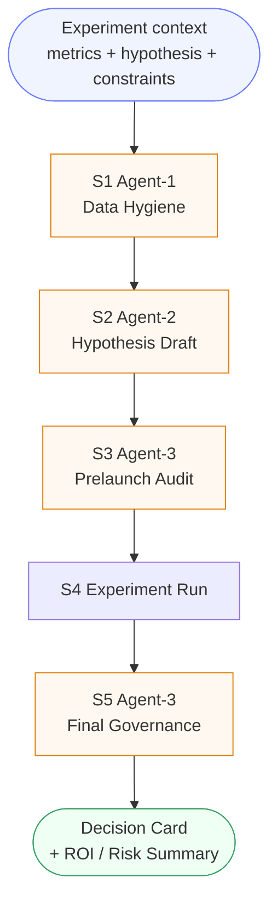

# DecisionGuard

> AI-native runtime for product experimentation and governance: from hypothesis and test launch to result interpretation and final rollout decision.

[](https://github.com/SA-Guliy/DecisionGuard/actions/workflows/ci-governance.yml)
[](https://www.python.org/downloads/release/python-311/)
[]()
[]()

---

> **Project status**
>
> DecisionGuard is **not finished** and is in **active development**.
> The public repository shows architecture, PoC results, core engineering choices, and the system direction, while part of the capabilities is still being calibrated, hardened, and validated.
>
> The most accurate framing today is: a **strong R&D / PoC runtime** with working governance logic, synthetic evaluation, and fail-closed orchestration, but not yet a finalized production product.

---

## Contents

- [What It Is](#what-it-is)
- [Why It Matters](#why-it-matters)
- [Who Benefits and Where](#who-benefits-and-where)
- [How It Works](#how-it-works)
- [Evidence-Grounded Decisions](#evidence-grounded-decisions)
- [Paired Experiment Mode](#paired-experiment-mode)
- [PoC Results](#poc-results)
- [What Is Being Improved Now](#what-is-being-improved-now)
- [Synthetic Evaluation Environment](#synthetic-evaluation-environment)
- [Engineering Depth](#engineering-depth)
- [Key Architectural Choices](#key-architectural-choices)
- [System Boundaries and Current Limits](#system-boundaries-and-current-limits)
- [Comparison](#comparison)
- [Quick Start](#quick-start)
- [Security and Path to Production](#security-and-path-to-production)
- [Repository Structure](#repository-structure)
- [Demo Artifacts](#demo-artifacts)
- [Contributing](#contributing)
- [License](#license)

---

## What It Is

**DecisionGuard** is an AI-native runtime for experimentation governance.

It supports the full decision lifecycle:

- prepare and validate input data;
- draft and refine a hypothesis;
- run a prelaunch governance audit;
- run an A/B experiment;
- interpret outcomes with guardrails, historical precedents, and risk context;
- produce a fail-closed rollout decision.

DecisionGuard can:

- sit on top of an existing experimentation stack;
- own part of the lifecycle in a more autonomous AI-driven contour;
- increase decision quality for analysts, PMs, and experimentation teams.

Core value is not only test execution, but **decision quality governance before, during, and after the experiment**.

---

## Why It Matters

Classic experimentation tooling answers:

_"Did the variant win?"_

DecisionGuard answers the more expensive business question:

_"Is this decision truly justified and safe under guardrails, data quality, historical patterns, operational constraints, and risk context?"_

A local lift in the primary metric is not enough for rollout.

The most expensive mistakes usually happen when:

- primary metric grows while decision quality drops;
- short-term wins hide guardrail downside;
- rollout looks statistically successful but is operationally or economically risky;
- interpretation is rushed and not systematically checked.

DecisionGuard is designed for exactly these cases.

---

## Who Benefits and Where

DecisionGuard is useful beyond experimentation teams.

It helps:

- **analysts**: formulate/refine hypotheses, interpret outcomes deeper, and detect hidden downside behind local wins;
- **product managers**: quickly see whether a decision is protected by metrics, guardrails, and downstream risk checks;
- **growth / experimentation teams**: reduce false rollout cost and make decisions more reproducible and auditable;
- **organizations with high decision quality standards**: where uplift alone is not enough and mechanism + risk need to be understood.

DecisionGuard is **domain-agnostic**.

The architecture relies on policy contracts, evidence-driven reasoning, fail-closed gates, and synthetic evaluation, so it can be adapted to different verticals and experimentation programs.

---

## How It Works

DecisionGuard follows governance state-machine `S1 → S2 → S3 → S4 → S5`:

- **S1 Data Hygiene (Agent-1)**: input quality, integrity, context completeness, and launch preconditions;
- **S2 Hypothesis Draft (Agent-2)**: hypothesis, expected effect logic, risk framing, interpretation conditions;
- **S3 Prelaunch Audit (Agent-3)**: launch-readiness audit of design, guardrails, and risks;
- **S4 Experiment Run**: execution and signal collection;
- **S5 Final Governance (Agent-3)**: final interpretation and rollout verdict.

Simplified flow:



Every call passes common control layers:

| Layer | What it does |
|------|---------------|
| **Privacy** | Sanitizes sensitive values before cloud LLM calls and restores only inside controlled runtime |
| **Resilience** | Supports fallback chain Groq → Ollama → deterministic local; release-candidate mode applies stricter policy constraints and cloud-preflight requirements |
| **Integrity** | Verifies artifact integrity and fails closed on tamper / missing sidecar |
| **Audit** | Writes audit trail for run, policy, backend, time, cost, and final status |

---

## Evidence-Grounded Decisions

DecisionGuard does not rely only on current-run metrics.

Before final verdict, it pulls **historical precedents** through retrieval and uses them as additional evidence.

Benefits:

- decision is not based on one current snapshot;
- similar past experiments become part of reasoning;
- final decision card can cite evidence rather than generic language;
- lower risk of speculative or hallucinated interpretation.

So the system answers not only "what happened now", but also "how this outcome aligns with already observed risk/success patterns".

---

## Paired Experiment Mode

DecisionGuard supports **paired experiment mode**: control and treatment run under one experiment ID, and live deltas are computed before final reasoning.

The system reasons on three evidence layers together:

1. **Live primary metric**: treatment vs control delta;
2. **Live guardrail metrics**: protective metric breaches;
3. **Historical patterns**: retrieved similar scenarios.

This enables governance-style reasoning instead of single-metric checks.

If treatment fails or data is incomplete, system does not emit false `GO`.
The decision ceiling is forced to `HOLD_NEED_DATA` (or equivalent fail-closed status).

---

## PoC Results

### What Is Already Demonstrated

Current PoC already demonstrates:

- working governance flow;
- synthetic benchmark evaluation;
- fail-closed decisioning;
- historical evidence retrieval;
- paired experiment logic;
- auditability and fallback resilience.

### Decision KPI

On current benchmark waves, DecisionGuard shows strong **decision KPI** stability.
These numbers must be interpreted **separately** from semantic depth gates and reasoning-quality sign-off.

| Wave set | Gate contract | FPR_non_go | FNR |
|---|---|---|---|
| `A5 / B5 / C5` | `release-candidate (pre-depth sign-off)` | `0.10 / 0.10 / 0.00` | `0.00 / 0.00 / 0.00` |

> Historical baseline and full contract migration are tracked in `RU_LOCAL_DOCS/EXECUTION_TRACKER_RU.md` and freeze artifacts, to avoid publishing unverified comparisons in README.

How to read this correctly:

- decision chain shows strong safety/stability improvement on legacy benchmark waves;
- this does **not** automatically mean semantic depth gate is closed;
- decision KPI and reasoning depth are **two different signals**, not a single “release-ready score”.

Correct public interpretation:

> **Decision KPI are already strong on the current synthetic benchmark, while semantic depth reasoning and depth-aware sign-off are still being strengthened as a separate track.**

### What to Keep in Mind About Reasoning Score

Average `staff_reasoning_score` increased significantly versus older `system.reasoning_quality_score`.

But this must **not** be interpreted as pure "model intelligence growth".

The result is influenced by multiple factors:

- new rubric and scale;
- more structured reasoning format;
- partial template-like fields in some reasoning outputs;
- reduced effect of technical defaults and fallback noise that are not direct reasoning depth.

So the accurate external wording is:

> **DecisionGuard materially improved governance score and decision stability on current synthetic benchmark; semantic reasoning depth strengthening remains in progress.**

---

## What Is Being Improved Now

Current focus is not only score growth, but making depth evaluation more robust against templating and formal pass-through.

In progress:

- separate scoring for **Agent-2** and **Agent-3**;
- higher weight on **semantic depth** (not only format compliance);
- split score into:
  - `FormatScore`
  - `SemanticDepthScore`
- shift decision gates to semantic criteria;
- anti-template constraints;
- mandatory case-specific evidence linkage;
- human blind-audit on random samples;
- drift checks between auto-score and human-score.

Target direction:

- **A2_HypothesisDepthScore** for hypothesis quality and analysis logic;
- **A3_GovernanceDepthScore** for final governance depth;
- stronger weighting of final semantic depth over superficial structure.

---

## Synthetic Evaluation Environment

DecisionGuard uses a **dynamic synthetic data environment** for realistic evaluation.

This is not a static fixture set.

The simulator models changing conditions where outcomes are affected by:

- user behavior and segmentation;
- churn/reactivation;
- demand spikes and drops;
- competitor pressure;
- supply constraints;
- operational noise;
- delayed effects hidden in short A/B windows.

This is needed to validate not only "which variant won", but whether decisions remain robust, realistic, and safe under harder context.

Publicly, we expose the high-level design: synthetic evaluation engine generates `safe / risky / borderline` scenarios and stress-tests the agent chain in near-realistic conditions.

Part of simulator mechanics, environment parameterization, and domain specifics intentionally stays private.

---

## Engineering Depth

| Layer | Implemented |
|------|-------------|
| **Policy-as-Code** | Machine-readable policy contracts, domain templates, externalized guardrail and decision logic |
| **Fail-Closed Runtime** | No silent pass-through: missing data, integrity gaps, and policy violations block false `GO` |
| **Security** | Sanitization before cloud calls, encryption for sanitization maps, audit trail, access control |
| **Resilience** | Fallback chain and controlled reconciliation after cloud recovery |
| **Observability** | Backend, latency, token usage, estimated cost, run status, blocked-by logging |
| **Evaluation** | Unit, integration, adversarial, and e2e; blocking CI currently covers core governance checks, contract integrity, and smoke checks; full regression/eval contour runs separately |
| **Evidence Layer** | Historical retrieval and evidence-grounded reasoning instead of isolated interpretation |
| **Synthetic Evaluation** | Dynamic scenario generator for complex chain-level evaluation |

---

## Key Architectural Choices

- **AI-native experimentation + governance**: system participates in hypothesis draft, prelaunch audit, and final governance.
- **Policy-as-Code**: critical business logic is not buried in ad-hoc if/else chains.
- **Fail-Closed by Default**: incomplete context or integrity/policy issues move decision to hold-path, not optimistic pass.
- **Evidence-Grounded Decisions**: reasoning must cite concrete signals, not generic text.
- **Replaceable-by-Python Mindset**: LLM layer must show measurable added value over deterministic logic.
- **Runtime Resilience**: controlled degraded mode under external failures, instead of total stop.
- **Auditability**: decisions, interim states, and block reasons are post-factum verifiable.
- **Synthetic-First Evaluation**: difficult risky/safe/borderline scenarios are tested beyond static hand-made fixtures.

---

## System Boundaries and Current Limits

Read the current state honestly.

At this stage:

- project is **not finished**;
- reasoning evaluation is **still being refined**;
- part of high score can come from formatting/rubric alignment, not only deeper reasoning;
- part of calibration work is still in progress;
- public repository does not claim completed real-world production validation;
- synthetic benchmark is already useful for chain validation, but does not replace full real-world validation.

Current correct positioning:

> **A strong AI experimentation/governance PoC with deep engineering and active semantic reasoning quality hardening.**

---

## Comparison

| | DecisionGuard | Classical experimentation platform | Custom rules engine |
|--|--------------|------------------------------------|---------------------|
| Hypothesis draft support | ✅ | Partial / stack-dependent | ❌ |
| Prelaunch governance | ✅ | Partial / process-dependent | ❌ |
| Final governance decision | ✅ | Partial | Partial |
| Historical evidence retrieval | ✅ | Usually no | ❌ |
| Fail-closed default | ✅ | Not always | Depends |
| Synthetic evaluation engine | ✅ | Usually no | ❌ |
| Privacy layer for LLM calls | ✅ | N/A | N/A |
| Audit trail for decision chain | ✅ | Partial | Depends |
| Autonomous AI-driven contour | Partial / evolving | ❌ | ❌ |

> DecisionGuard can run on top of Statsig, LaunchDarkly, or internal stacks, and can also own a more autonomous contour:
> **hypothesis draft → prelaunch audit → experiment run → final governance decision**.

---

## Quick Start

### 1. Set LLM API key

DecisionGuard supports cloud LLM backend and fallback path.
Without key, part of reasoning is limited or routed to local/deterministic mode.

```bash
echo "GROQ_API_KEY=gsk_..." > ~/.groq_secrets
echo "LLM_ALLOW_REMOTE=1"  >> ~/.groq_secrets
chmod 600 ~/.groq_secrets
```

### 2. Configure environment

Copy `.env.example` and define main parameters:

```bash
CLIENT_DB_HOST=...
CLIENT_DB_PORT=5432
CLIENT_DB_NAME=...
CLIENT_DB_USER=...
CLIENT_DB_PASS=...
SANITIZATION_KMS_MASTER_KEY=local_demo_key
SANITIZATION_READER_ROLE=runtime_orchestrator
```

### 3. Pick domain template

```bash
domain_templates/darkstore_fresh_v1.json
```

### 4. Run orchestration

```bash
python3 scripts/run_all.py \
  --run-id demo_run_001 \
  --experiment-id exp_demo_001 \
  --domain-template domain_templates/darkstore_fresh_v1.json \
  --allow-remote-llm 1
```

### 5. Build reports

```bash
python3 scripts/build_executive_roi_report.py --batch-id executive_batch_001
python3 scripts/build_batch_consolidated_report.py --batch-id executive_batch_001
```

---

## Security and Path to Production

DecisionGuard already demonstrates mature security/integrity choices, but production path is still in progress.

Key directions:

- managed KMS / Vault instead of local demo keys;
- corporate proxy / DLP for all LLM traffic;
- further calibration of reasoning quality gates;
- stricter release-candidate policy for fallback and cloud-preflight sign-off;
- stronger human approval flows;
- additional real-world validation;
- extended reconciliation monitoring;
- deeper separation of format compliance vs semantic depth in reasoning evaluation.

---

## Repository Structure

```text
src/               Common runtime modules: security, failover, contracts, orchestration
scripts/           Pipelines, gates, batch eval, report tooling
configs/contracts/ Machine-readable contracts and policy
domain_templates/  Externalized domain physics and policy configuration
docs/              Methodology, runbooks, architecture specs
tests/             Regression, fail-closed, and contract tests
examples/          Demo guide + minimal public fixtures
```

---

## Demo Artifacts

Public `examples/` includes:

- `DEMO_GUIDE.md` (+ `.sha256`);
- minimal machine-checkable fixtures for reproducible checks.

Detailed demo reports, internal historical corpora, and extended synthetic datasets are maintained in a private contour and are not published in public history.

---

## Contributing

This is currently an evaluation/portfolio repository.

If you review the project and want to discuss architecture, integration, or roadmap, open a discussion or contact the maintainer directly.

---

## License

Internal/private evaluation repository unless explicitly stated otherwise.
