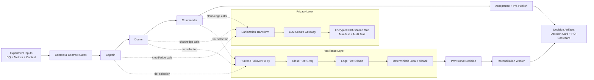

# Privacy-First AI Governance for Marketplace P&L

Enterprise decision-governance runtime that protects marketplace P&L and unit economics from costly experiment mistakes while preserving business continuity with fail-closed controls and edge fallback.

## Executive Summary
This platform is an **AI-Driven A/B Test Governance Layer** built to protect revenue, margin, and unit economics in experimentation-heavy businesses.

It is designed for teams where a "successful" A/B test can still damage real P&L through delayed side effects (margin erosion, fulfillment stress, churn, support spikes).

It combines:
- deterministic multi-agent audit (`Captain -> Doctor -> Commander`),
- privacy-first LLM mediation (`sanitization_transform + llm_secure_gateway`),
- zero-downtime resilience (`cloud -> edge -> deterministic` runtime failover),
- executive-facing ROI observability (availability, FPR/FNR, reconciliation, cost).

## Business Value
- Metric protection: catches locally-good but globally-harmful rollouts before release.
- Fail-closed governance: integrity gaps, missing evidence, or policy violations stop the pipeline.
- Data sovereignty: sensitive values are obfuscated before cloud inference, with local reversible mapping under policy.
- Operational resilience: when cloud LLM is unavailable, edge fallback keeps decisioning alive and marks outcomes as provisional.
- Auditability: machine-readable contracts, gate artifacts, and sidecar integrity checks create an inspection trail for risk and compliance teams.
- Calculated Risk policy: the system minimizes false positives by dynamically balancing theoretical risk against clear business lift. It does not blindly block every risky hypothesis, enabling faster time-to-market while preserving guardrails.
- Example template (replace with validated test evidence only): `Blocked a [Experiment Type] experiment that showed +[XX]% [Primary Metric] locally but carried a hidden -[YY]% [Guardrail Metric] erosion at scale.`

## Architecture


Technical deep-dive: see [`ARCHITECTURE.md`](ARCHITECTURE.md).

## Quick Start
### 1. Configure environment
Use `.env.example` as baseline.

Core variables:
- `CLIENT_DB_HOST`, `CLIENT_DB_PORT`, `CLIENT_DB_NAME`
- `CLIENT_DB_USER`, `CLIENT_DB_PASS`
- `SANITIZATION_KMS_MASTER_KEY`
- `SANITIZATION_READER_ROLE=runtime_orchestrator`

For local demo:
```bash
export SANITIZATION_KMS_MASTER_KEY=local_demo_key
export SANITIZATION_READER_ROLE=runtime_orchestrator
```
⚠️ `local_demo_key` is sandbox-only. **DO NOT USE IN PRODUCTION**.

### 2. Choose domain template
Domain physics is externalized:
- `domain_templates/darkstore_fresh_v1.json` (public demo template)

### 3. Run orchestration
```bash
python3 scripts/run_all.py \
  --run-id demo_run_001 \
  --domain-template domain_templates/darkstore_fresh_v1.json
```

### 4. Build executive ROI scorecard
```bash
python3 scripts/build_executive_roi_report.py --batch-id executive_batch_001
```

If legacy artifacts do not yet have sidecars:
```bash
python3 scripts/build_executive_roi_report.py --batch-id executive_batch_001 --integrity-required 0
```

### 5. Batch summary + consolidated report (summary-only SoT)
```bash
python3 scripts/run_batch_eval.py \
  --batch-id executive_batch_001 \
  --backend groq \
  --max-cases 20

python3 scripts/build_batch_consolidated_report.py --batch-id executive_batch_001
```

Policy note:
- Batch transport is explicit file output only (`--batch-record-out` internally from `run_batch_eval`).
- Consolidated report consumes only `data/batch_eval/<batch_id>_summary.json`.

### 6. Cleanup Sprint-2 POC artifacts (fail-closed)
```bash
python3 scripts/cleanup_poc_artifacts.py
```

Cleanup defaults to strict integrity (`--strict-integrity 1`): missing/invalid `.sha256` sidecar causes non-zero exit.
Only golden pair under `reports/L1_ops/demo_golden_example` is allowed to remain.
Cleanup produces migration artifacts:
- `_PROJECT_TRASH/MIGRATION_MANIFEST.json`
- `_PROJECT_TRASH/MIGRATION_MANIFEST.md`
- `_PROJECT_TRASH/rollback.sh`

## Executive Demo Output Examples
Public demo artifacts are published from a single SoT:
- `examples/investor_demo/reports_for_humans/executive_roi_scorecard.md`
- `examples/investor_demo/reports_for_humans/decision_card.md`

Representative scorecard lines:
```text
Verdict: GO / CONDITIONAL GO / NO-GO
Zero-Downtime Availability: 98.5%
False Negative Rate: 3.2%
False Positive Rate: 11.4%
Reconciliation Match-Rate: 87.0%
```

These outputs are designed for executive review, not only engineering diagnostics.

## Security & Tech Debt (Path to Production)
This repository includes explicit POC-mode shortcuts for demo speed. They are intentional, visible, and must be closed before production rollout.

1. Network / Proxy
   Current POC behavior:
   Some local demo runs may bypass enterprise proxy constraints for connectivity.
   Production requirement:
   Route all outbound LLM traffic through corporate proxy/DLP with managed certificates and egress policy enforcement.

2. KMS Master Key
   Current POC behavior:
   `SANITIZATION_KMS_MASTER_KEY=local_demo_key` is allowed for local sandbox.
   Production requirement:
   Load master key material from enterprise secret management (AWS KMS / HashiCorp Vault), with rotation, access policy, and audit controls.

3. Audit Integrity Strictness
   Current POC behavior:
   ROI scorecard supports `--integrity-required 0` for legacy artifact compatibility.
   Production requirement:
   Enforce strict integrity mode only (`--integrity-required 1`) and block override in release pipelines.

4. Release Policy
   Current POC behavior:
   Demo and production controls can coexist in one code path.
   Production requirement:
   Separate demo profile from production profile and enforce policy by environment (CI/CD + runtime contracts).

## Repository Layout
- `scripts/` runtime pipeline, gates, and executive/report tooling
- `src/` shared runtime modules (security, failover, contracts)
- `configs/contracts/` machine-readable contracts and policies
- `domain_templates/` external domain policy
- `docs/` methodology, runbooks, architecture specs
- `tests/` regression, fail-closed, and contract tests

## Executive Demo Assets
- `examples/investor_demo/DEMO_GUIDE.md`
- `examples/investor_demo/reports_for_humans/executive_roi_scorecard.md`
- `examples/investor_demo/reports_for_humans/decision_card.md`
- `examples/investor_demo/reports_for_agents/batch_summary.json`

## GitHub Release Packaging (staging_only)
Public showcase packaging is isolated from runtime artifacts.

1. Build sanitized demo SoT:
```bash
python3 scripts/build_investor_demo_staging.py --publish-mode staging_only --apply 1
```

2. Build physical publish-root (`github_publish/`) and export manifest:
`build_investor_demo_staging.py` now creates:
- `github_publish/` (staging-only publish set)
- `github_publish/PUBLISH_EXPORT_MANIFEST.json` (+ `.sha256`)

3. Run blocking pre-push audit against real publish-set:
```bash
python3 scripts/run_publish_release_audit.py \
  --publish-mode staging_only \
  --publish-root github_publish \
  --strict 1
```

4. Review control files:
- `PUBLISH_WHITELIST.txt`
- `PUBLISH_DENYLIST.txt`
- `PUBLISH_MANIFEST.md`
- `PUBLISH_AUDIT_CHECKLIST.md`
- `CLEANUP_RUNBOOK.md`

Only `examples/investor_demo/` is the public demo Source of Truth.

## License
Internal/private evaluation repository unless explicitly stated otherwise.
